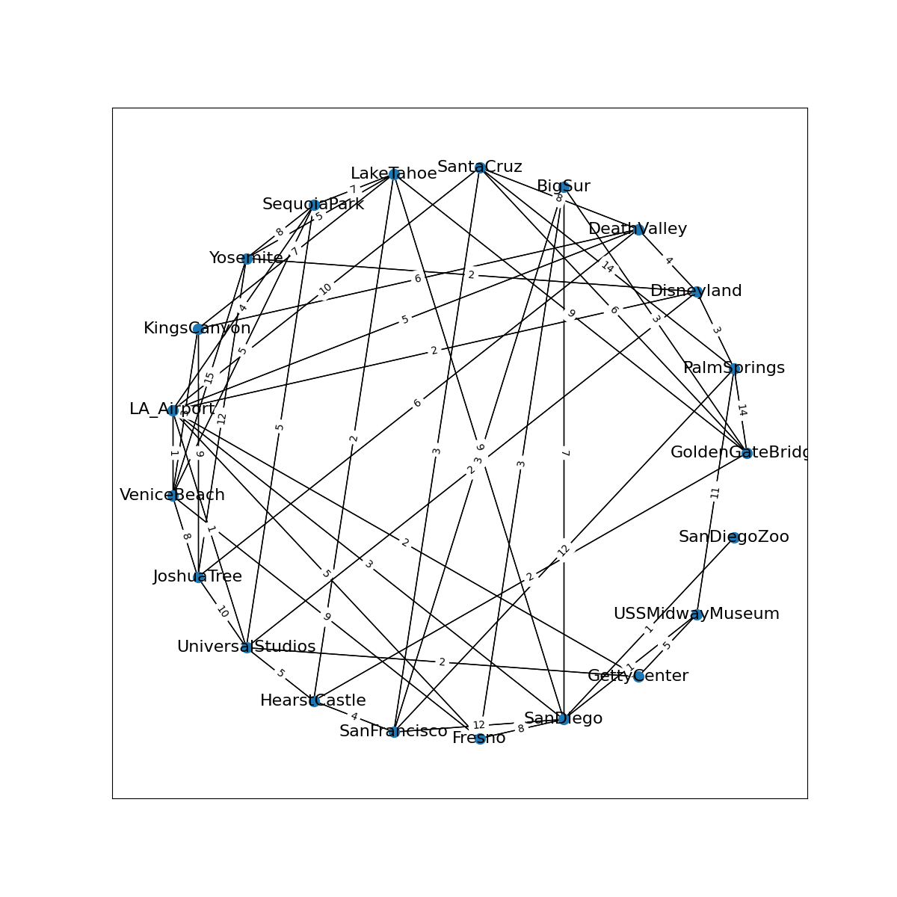

# Transportations

**CISC320 Spring 2023 Lesson 14 - Graph Applications**

Group Members:
* Paul Kearney (paulke@udel.edu)
* Jon O'Connell (jjoc@udel.edu)
* Third member (email)
* Fourth member (email)

Description of project

Our project heavily revolves around modes of transportation. This is what we all gravitated towards when we were thinking
of real world applications of graphing algorithms. 

## Installation Code

```sh
$> pip install networkx
```

## Python Environment Setup

```python
import networkx as nx
```

# busing in CA
**Informal Description**: 
A tour bus company based in LA wants to map out new routes and want to stop as often as possible to
pick up new travelers, but also stop at every popular tourist destination. in order to do this, the tour bus 
company wants to pick routes such that the bus drives on the shortest road to get to each location.
> **Formal Description**:
>  * Input: An undirected graph of tourist destinations. edges being roads that connect destinations,vertices 
>  * the destinations themselves.
>  * Output: minimum spanning tree of tourist destinations

**Graph Problem/Algorithm**: MST


**Setup code**:

```python
edges = []
with open("tourist_destinations.txt") as data_file:
    lines: list[str]
    lines = data_file.readlines()
edgeList = lines[1:]
destinations = nx.Graph()
for edge in edgeList:
    edges.append(edge.split(","))
for edge in edges:
    test = edge[2]
    destinations.add_edge(edge[0], edge[1], weight=int(edge[2]))
pos = nx.circular_layout(destinations)
plt.figure(20,figsize=(12,12))
labels = nx.get_edge_attributes(destinations,'weight')
nx.draw_networkx(destinations,pos, node_size=100, font_size=16)
nx.draw_networkx_edge_labels(destinations,pos,edge_labels=labels)
plt.savefig("graph_for_prims.png")
```
**Visualization**:



**Solution code:**

```python
solution = nx.minimum_spanning_tree(destinations,algorithm="prim")
print(solution.edges(data=True))

```

**Output**
```
[('GoldenGateBridge', 'BigSur', {'weight': 3}), ('GoldenGateBridge', 'HearstCastle', {'weight': 2}),
('PalmSprings', 'Disneyland', {'weight': 3}), ('Disneyland', 'LA_Airport', {'weight': 2}),
('Disneyland', 'Yosemite', {'weight': 2}), ('Disneyland', 'DeathValley', {'weight': 4}),
('DeathValley', 'JoshuaTree', {'weight': 6}), ('BigSur', 'Fresno', {'weight': 3}),
('BigSur', 'SanFrancisco', {'weight': 3}), ('SantaCruz', 'SanFrancisco', {'weight': 3}),
('LakeTahoe', 'HearstCastle', {'weight': 2}), ('SequoiaPark', 'LA_Airport', {'weight': 4}), 
('KingsCanyon', 'VeniceBeach', {'weight': 3}), ('LA_Airport', 'VeniceBeach', {'weight': 1}), 
('LA_Airport', 'UniversalStudios', {'weight': 1}), ('LA_Airport', 'GettyCenter', {'weight': 2}),
('LA_Airport', 'SanDiego', {'weight': 3}), ('LA_Airport', 'Fresno', {'weight': 5}), ('SanDiego',
'USSMidwayMuseum', {'weight': 1}), ('SanDiego', 'SanDiegoZoo', {'weight': 1})]


```

**Interpretation of Results**:
LA seems to be a great location for the tour bus company as it is around so many attractions and there are many
short roads connected to the LA airport. The buses can stop often to bring in new customers and drop off
customers who already paid with these new routes.


# Travel Company Troubles
**Informal Description**: 
A travel company wants to streamline what flights they give to their customers. After too many complaints about 
giving long travel days to their clients, they want to now send people to their destination the quickest way.
Regardless of how, they want to send their clients to the destination as fast as they can. If an Atlanta Falcons fan
wants to go to Las Vegas to see the Raiders play, which flights should the ailine give them?

> **Formal Description**:
>  * Input: An undirected graph of airports, edges being flight paths that connect terminals,vertices are 
>  * the airports themselves.
>  * Output: The shortest path from the source to the final destination, in this case ATL to LAS.
**Graph Problem/Algorithm**: SSSP


**Setup code**:

```python
import networkx as nx
import matplotlib.pyplot as plt
graph = {"PHL":{"LAX": {'weight': 8}, "CLT": {'weight': 2}, "PHX":{'weight': 6},
                "ORD": {'weight': 3},"ATL":{'weight':2},"BOS":{"weight":1}},
          "CLT": {"MIA":{"weight":2},"STL":{"weight":2},"DFW":{"weight":4},
                  "MEM":{"weight":1},"DEN":{"weight":4}},
          "PHX": {"LAX": {'weight': 2},"DEN":{"weight":3},"STL":{"weight":4}},
          "ORD": {"LAX": {"weight": 5},"DFW":{"weight":6}, "ATL":{"weight":5}},
          "IAD": {"BOS":{"weight":2},"ATL":{"weight":3}},
          "SEA": {"LAS": {'weight': 3}, "SFO":{'weight':2}, "SLC":{"weight":3},
                  "ORD":{'weight':5}},
          "LAS": {"LAX":{"weight":1}, "MIA":{"weight":9},"MEM":{"weight":4}},
          "SFO":{"LAX":{"weight":1},"DEN":{'weight':2},"STL":{"weight":4},},
          "DFW":{"DEN":{"weight":2},"MIA":{"weight":4},"DTW":{"weight":5},
                 "CLE":{"weight":4}},
          "MIA":{"ATL":{"weight":2},"IAD":{"weight":4},"BOS":{"weight":7}},
          "STL":{"MEM":{"weight":2},"SLC":{"weight":3}, "DTW":{"weight":1},
                 "CLE":{"weight":1}},
          "BOS":{"LAX":{"weight":10},"CLE":{"weight":5},"CLE":{"weight":2}},
          "HNL": {"LAX":{"weight":13},"SFO":{"weight":13}}
          }
G = nx.from_dict_of_dicts(graph)

pos = nx.shell_layout(G)
labels = nx.get_edge_attributes(G,'weight')
plt.figure(1,figsize=(12,12)) 
nx.draw_networkx(G,pos, node_size=100, font_size=16)
nx.draw_networkx_edge_labels(G,pos,edge_labels=labels)
```
**Visualization**:


**Solution code:**

```python
djikstra = nx.dijkstra_path(G,"ATL","LAS", weight='weight')
print(djikstra)

```

**Output**
```
['ATL', 'PHL', 'CLT', 'MEM', 'LAS']
```

**Interpretation of Results**:
The resulting list is an order set of vertices giving the shortest path from the source to the destination.
For this problem, that is the shortest flight path from Atlanta(ATL) to Las Vegas(LAS).
